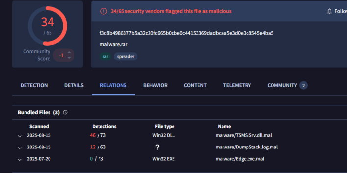
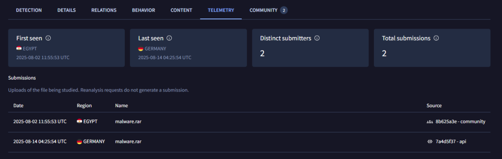

# Task Malware-Analysis Earth-Baxia-APT

- Earth Baxia, APT của tàu , đám này có nhắm vào VN.

- Ok em. Anh cũng từng gặp đám này rồi. Em phân tích mẫu, khi nào xong thì so sánh thử với mẫu anh phân tích xem có khác gì không. Con này khác là nó dùng APT để triển khai ransomware. Còn mẫu anh phân tích thì nó dùng cobalt beacon.

- Sample khả năng đang có đám nào pt nên mới nén toàn bộ mẫu với tên như hình

- Đây là con ransom mà nó decrypt từ mớ trên ra. Để em compare thử với quá trình em phân tích từ đầu nhé <@nigmaz>

- https://blog.vincss.net/vi/re013-cach-dump-pe-file-tu-bo-nho-bang-ida-2/
